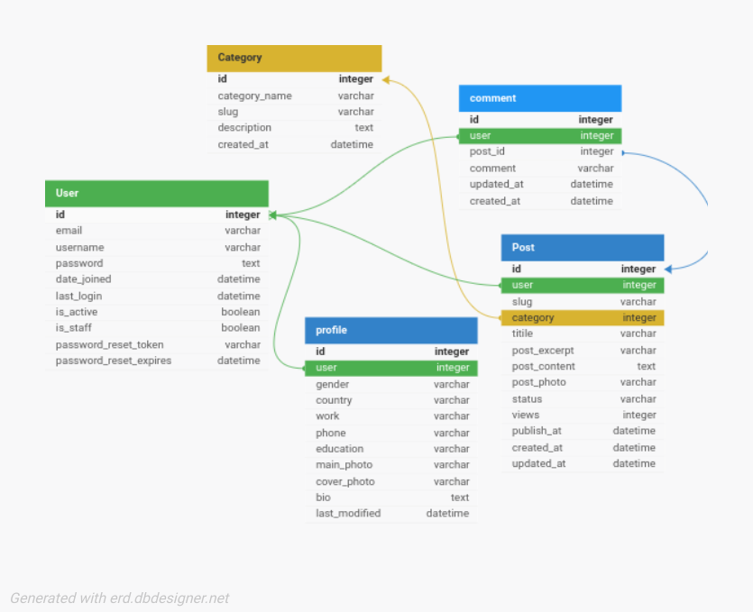

# Advanced Blog 
This API provides functionality for a user profile system and a blog website. Users can create posts, update their profiles, and interact with blog 
content.

---

## Database



## Users
1. Account Creation
2. Email Verification
3. Resend Verification Email
4. Authentication : Login Via (Username Or Email) And Password
5. Logout (with refresh token blacklisting)
6. Reset Password (via email)
7. Change Password
8. Update user information:
```
first_name, last_name,, email, password, gender, country, work, phone,education, main_photo, cover_photo, bio,
```
9. Retrieve user's posts
9. Search posts
10. Order posts by: ['title', '-title', 'publish_at', '-publish_at']


## Blog
1. Post Creation
2. Post Listing with Filtering and Ordering
3. Add/Edit comment to post
4. View post and associated comments via slug
5. Edit single filed (like edit title or category)
6. Post Deletion

## Security
**This API implements security best practices as recommended by OWASP API Security Top 10**

## API Postman
import file **Advanced-blog.postman_collection.json** to Postman


## Installation

First add your mailtrap information in project/settings.py

```sh
git clone https://github.com/badr-azeez/advanced-blog-api.git
cd  advanced-blog-api
python3 -m venv venv
source venv/bin/activate  # On Windows, use `venv\Scripts\activate`
pip  install -r requirements.txt
#run
python manage.py runserver
```
### admin credit
```
username : admin
password : admin
```
## License

Apache 2.0 License